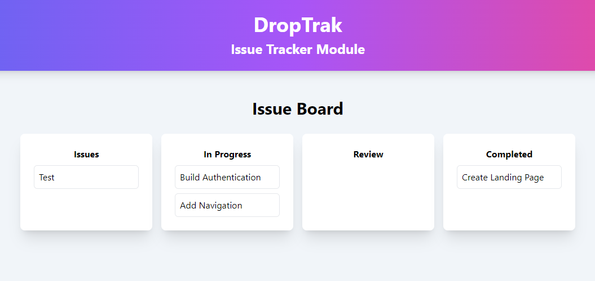
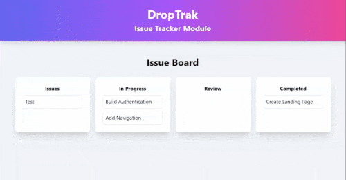

# Issue Tracker | React Beautiful DnD
> A simple issue tracker test project

<!-- [![Netlify][netlify-img]][netlify-url] -->
[![GitHub repo size][github-img]][github-url]
[![GitHub last commit][github-commit]][github-url]

<!-- Badges to Add: Netlify build, twitter, license? -->

_Featuring drag and drop capabilities, this issue tracker provides the user with a simple way to view and organize code issues._

<p align="center">
  
</p>

</br>

## Features

_Users can have fun moving their issues and tasks around. This app features:_
- Ability to drag columns into a new order
- Ability to move task to different columns
- Ability to re-order tasks in a column

### [Demo](https://friendly-redux-shopping-cart.netlify.app/)

### Technology

  1. Reactjs
  2. @hello-pangea/dnd instead of react-beautiful-dnd (see known issues)
  3. TailwindCSS
  4. Netlify Deployment

### :lady_beetle: Bugs and Known Issues

Currently, installation of react-beautiful-dnd (v13.1.0) fails with React 18. Workarounds include:
 - Downgrade to React 17
 - Install using `-peer-legacy` command via npm + disabling `<React.StrictMode>`
 - Use an alternate Drag and Drop package

See [react-beautiful-dnd issues](https://github.com/atlassian/react-beautiful-dnd/issues/2399) for more details. Disabling `<React.StrictMode>` is also currently required for projects using beautify-dnd that recently upgraded to React 18.

An alternate package was recently released based on a fork of react-beautiful-dnd which supports React 18 and strict mode called [@hello-pangea/dnd](https://www.npmjs.com/package/@hello-pangea/dnd)

   1. npm install @hello-pangea/dnd
   2. Replace all imports of react-beautiful-dnd with @hello-pangea/dnd
   3. Enjoy!

## Getting Started

These instructions will get you a copy of the project up and running on your local machine for development and testing purposes. See deployment for notes on how to deploy the project on a live system.

### Installation

_Easily set up a local development environment_

 - clone or download zip file
 - cd into root
 - `npm install`
 - `npm start`


## Usage

Simply click and drag an issue from one column to the next. Changing the task order within columns is super easy too!

<p align="center">
  
</p>

</br>


## Deployment

This project is hosted on Netlify. To deploy your own copy, you will need to set up a Netlify account. Netlify offers a generous free tier to developers.

Before deploying to Netlify you need to create a build:

```
$ npm run build
```

It is a good idea to test your build by serving it on your localhost. Once you are happy with your build, open up your Netlify Account.

For a basic deploy, you can simply drag and drop the build folder onto your Netlify Sites directory. See [Get started with Netlify](https://docs.netlify.com/get-started/) for details.

## Meta

Your Name – [@YourTwitter](https://twitter.com/dbader_org) – YourEmail@example.com

Distributed under the XYZ license. See ``LICENSE`` for more information.

[https://github.com/yourname/github-link](https://github.com/dbader/)


## Acknowledgments

* [Beautiful & Accessible Drag and Drop with react-beautiful-dnd][tutorial-url] - by Alex Reardon
* Confluence link:
* Asana board:
* etc...

## :books: Learning Resources

Tutorial
   - [CRUD Operations with React and Redux Toolkit](https://www.youtube.com/watch?v=SgnlgEEkqSo) by Cand Dev

Layouts with React Router 6
   - [React Router v6 Shared layouts](https://stackoverflow.com/questions/70236929/react-router-v6-shared-layouts)
   - [React Router Example](https://stackblitz.com/github/remix-run/react-router/tree/main/examples/basic?file=src%2FApp.tsx)

Use of Index Files
   - [How do index.js files work in React component directories?](https://stackoverflow.com/questions/44092341/how-do-index-js-files-work-in-react-component-directories)


## :memo: Notes

### 1. Nanoid
Nanoid is now part of React Toolkit, so you do not have to add a separate package unless your project requires a different universal identifyer.


<!-- Markdown link & img dfn's -->
[github-img]: https://img.shields.io/github/repo-size/lisawagner/beautiful-dnd-issue-tracker?logo=github&style=flat-square
[github-url]: https://github.com/lisawagner/beautiful-dnd-issue-tracker
[github-commit]: https://img.shields.io/github/last-commit/lisawagner/beautiful-dnd-issue-tracker?logo=github&style=flat-square

[netlify-img]: https://img.shields.io/netlify/8f53362b-5385-445d-bff8-fbf44086fa13?style=flat-square
[netlify-url]: https://todoodles-redux-toolkit-tailwind-app.netlify.app/

[tutorial-url]: https://egghead.io/courses/beautiful-and-accessible-drag-and-drop-with-react-beautiful-dnd